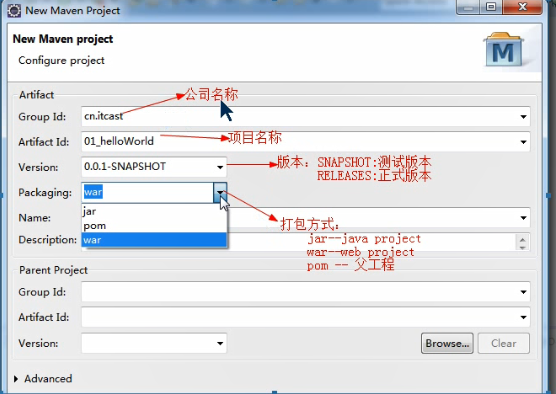
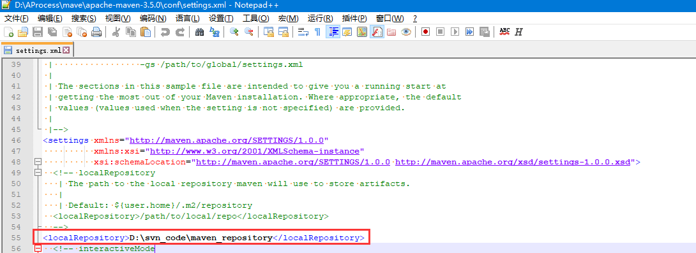

# Maven 基础

* 介绍 maven是Apache公司开源项目,是项目构建工具

  ## Maven的好处

  * 同样的代码,功能一样,Maven项目中没有jar包
  * jar包坐标:公司名称+项目名称+版本信息  Apache-struct2+2.3.24

  ## Maven标识

  ```Maven
  artifactId  项目的唯一的标识符，实际对应项目的名称，就是项目根目录的名称
  groupId   项目组织唯一的标识符，实际对应JAVA的包的结构，是main目录里java的目录结构
  version  版本名称
     GroupId和ArtifactId被统称为“坐标”是为了保证项目唯一性而提出的，如果你要把你项目弄到maven本地仓库去，你想要找到你的项目就必须根据这两个id去查找。 
    GroupId一般分为多个段，这里我只说两段，第一段为域，第二段为公司名称。域又分为org、com、cn等等许多，其中org为非营利组织，com为商业组织。举个apache公司的tomcat项目例子：这个项目的GroupId是org.apache，它的域是org（因为tomcat是非营利项目），公司名称是apache，ArtifactId是tomcat。 
     比如我创建一个项目，我一般会将GroupId设置为cn.mht，cn表示域为中国，mht是我个人姓名缩写，ArtifactId设置为testProj，表示你这个项目的名称是testProj，依照这个设置，在你创建Maven工程后，新建包的时候，包结构最好是cn.zr.testProj打头的，如果有个StudentDao[Dao层的]，它的全路径就是cn.zr.testProj.dao.StudentDao
    
  ```



## Maven仓库类型

* 本地仓库

  

* 私服

* 中央仓库


## Maven配置文件

* pom.xml  Maven核心配置文件 Project Objective  module 

  

## Maven基础命令

* clean 	清理

  将目录下target目录清除

* compile 编译

  将项目中.java编译为.class

* test         测试

  单元测试类名要求xxxxTest.java

  将项目目录src/test/java下所有单元测试都会执行一遍

* package 打包

  web Project   war包

  java Project   jar包

  打包生成在target目录下

* install    安装

  解决本地多个项目公用一个jar包 打包到本地仓库

## Maven项目的生命周期

在Maven中存在"三套"生命周期,每一套都相互独立,互不影响;在一套生命周期内执行后面的,前面都会按顺序执行;

* CleanLifeCycle 清理生命周期   clean
* defaultLifeCycle 默认生命周期   compile,test,package,install,deploy
* siteLifeCycle  站点生命周期  site